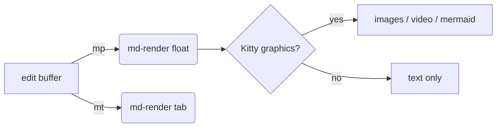

# md-render demo

A scratch file to exercise `md-render.nvim`. Open and press `<leader>mp` for a
floating preview, or `<leader>mt` for a tab preview.

## Inline formatting

Plain, **bold**, *italic*, ***bold italic***, ~~strikethrough~~, `inline code`,
==highlighted==, a [link](https://neovim.io), and an autolink:
<https://github.com/delphinus/md-render.nvim>.

## Lists

- unordered one
- unordered two
  - nested
  - nested with `code`
- unordered three

1. ordered one
2. ordered two
3. ordered three

Task list:

- [x] install plugin
- [x] bind `<leader>mp`
- [ ] open this file in preview

## Tables

| Feature       | Status | Notes                              |
| :------------ | :----: | ---------------------------------: |
| inline format |   ok   | bold / italic / strike / highlight |
| tables        |   ok   | alignment + inline formatting      |
| code blocks   |   ok   | treesitter highlight               |
| images        |   ok   | needs Kitty graphics               |
| mermaid       |   ok   | needs `mmdc`                       |

## Callouts

> [!NOTE]
> A standard note callout.

> [!TIP]
> Bind `<leader>md` to see every supported notation.

> [!WARNING]
> Image and video rendering require a Kitty-graphics terminal.
> You're on Ghostty, so you're set.

> [!IMPORTANT]
> `mermaid-cli` (`mmdc`) is needed for diagrams. Without it the plugin falls
> back to `npx -y @mermaid-js/mermaid-cli` (slow first run).

## Code blocks

```lua
local function greet(name)
  return ('hello, %s'):format(name or 'world')
end

print(greet('md-render'))
```

```python
def fib(n: int) -> int:
    a, b = 0, 1
    for _ in range(n):
        a, b = b, a + b
    return a
```

```bash
nvim +MdRenderPager README.md
```

## Mermaid



## Images

Local image (replace path with one that exists if you want to verify):


Web image:


## Collapsible

<details>
<summary>Click to expand</summary>

Hidden content. Inline `code`, **bold**, and a [link](https://example.com)
all still render inside `<details>`.

</details>

## Blockquote

> "The best editor is the one you stop noticing."
>
> -- someone, probably

## Horizontal rule

---

End of demo.
