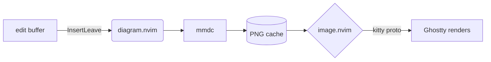
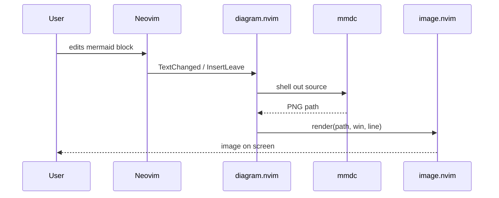
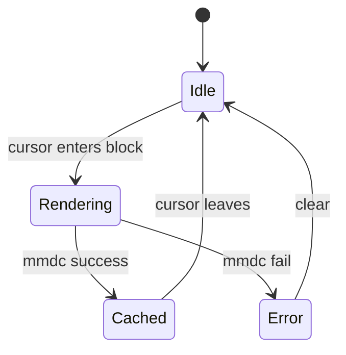
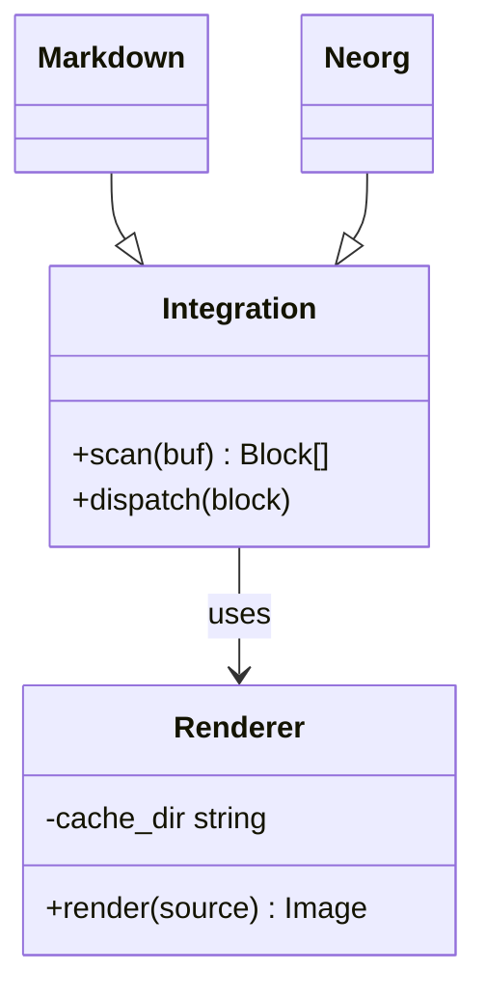
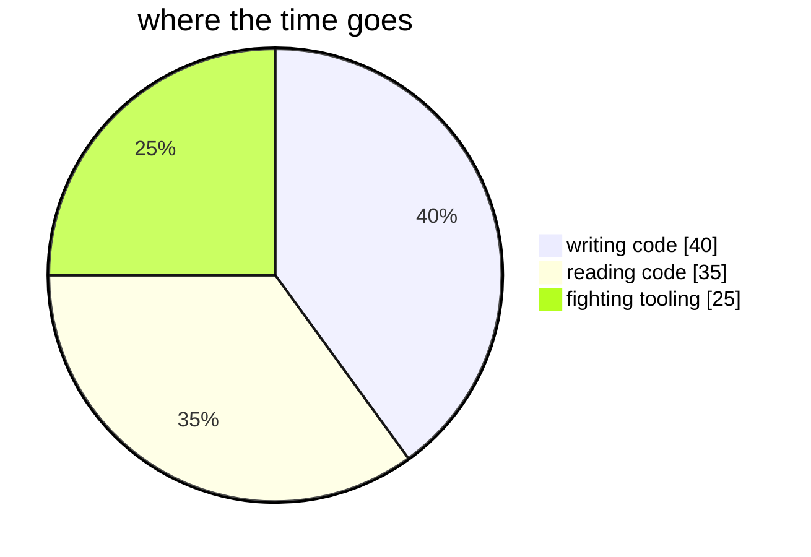
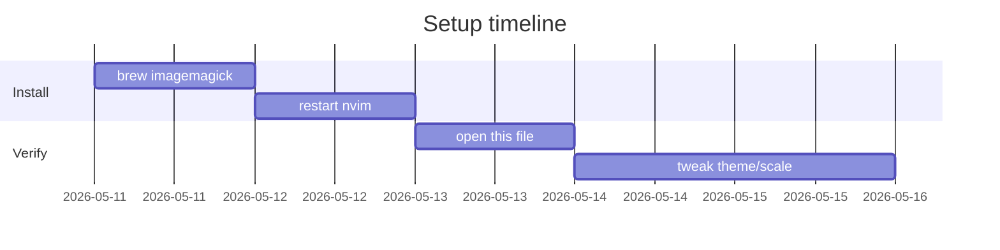

# diagram.nvim mermaid demo

Open this file, place the cursor inside any `mermaid` code block, leave insert
mode (or just sit still in normal mode), and the diagram should render below
the block via `image.nvim`.

If nothing shows up, run `:checkhealth image` and `:messages`.

## Flowchart

## Sequence

## State

## Class

## Pie

## Gantt

